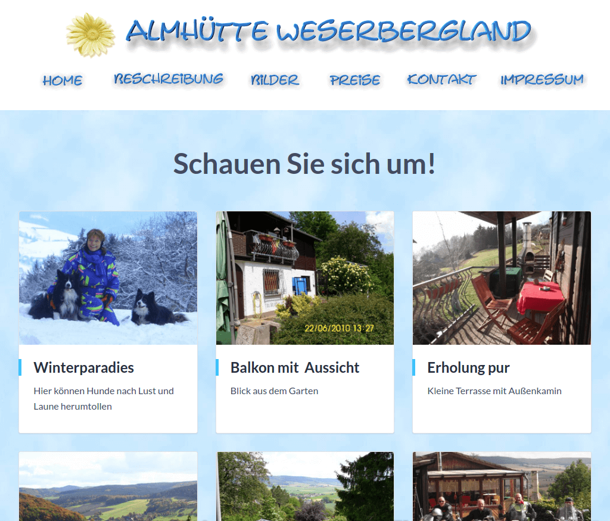

# ✨ weserbergland-almhuette ✨

[Jekyll](https://jekyllrb.com)-Seite mit Git als [CMS](https://en.wikipedia.org/wiki/Content_management_system). Seiten-Editor: [Stackbit](https://www.stackbit.com?utm_source=project-readme&utm_medium=referral&utm_campaign=user_themes). Build-Zeit: unter einer Minute.

Mit Stackbit lassen sich verschiedene [Vorlagen](https://app.stackbit.com/create?theme=https://github.com/stackbit-themes/exto-unibit&utm_source=project-readme&utm_medium=referral&utm_campaign=user_themes) wie diese benutzen. Wie wäre es mit einer anderen?

        
🨠&nbsp;<strong>Vorlagen</strong>

        <ul>
                <li><a href="https://app.stackbit.com/create?theme=https://github.com/stackbit-themes/fresh-unibit&utm_source=project-readme&utm_medium=referral&utm_campaign=user_themes">Persönliche Seite mit Blog</a></li>
                <li><a href="https://app.stackbit.com/create?theme=https://github.com/stackbit-themes/azimuth-unibit&utm_source=project-readme&utm_medium=referral&utm_campaign=user_themes">Schickes SaaS Theme</a></li>
                <li><a href="https://app.stackbit.com/create?theme=https://github.com/stackbit-themes/starter-unibit&utm_source=project-readme&utm_medium=referral&utm_campaign=user_themes">Ultra anpassbarer Starter. Der Favorit bei Entwicklern.</a></li>
                </ul>

        
✏️ &nbsp;<strong>CMS-Auswahl</strong>

        <ul>
                <li><a href="https://app.stackbit.com/create?cms=contentful&utm_source=project-readme&utm_medium=referral&utm_campaign=user_themes">Contentful</a></li>
                <li><a href="https://app.stackbit.com/create?cms=sanity&utm_source=project-readme&utm_medium=referral&utm_campaign=user_themes">Sanity</a></li>
                <li><a href="https://app.stackbit.com/create?cms=datocms&utm_source=project-readme&utm_medium=referral&utm_campaign=user_themes">Dato CMS</a></li>
                </ul>

        
⚙️ &nbsp;<strong>Static-Site-Generatoren</strong>

        <ul>
                <li><a href="https://app.stackbit.com/create?ssg=gatsby&utm_source=project-readme&utm_medium=referral&utm_campaign=user_themes">Gatsby</a></li>
                <li><a href="https://app.stackbit.com/create?ssg=nextjs&utm_source=project-readme&utm_medium=referral&utm_campaign=user_themes">Next.js</a></li>
                <li><a href="https://app.stackbit.com/create?ssg=hugo&utm_source=project-readme&utm_medium=referral&utm_campaign=user_themes">Hugo</a></li>
                </ul>

## Lokal entwickeln

1.  Installiere eine vollständige [Ruby-Entwicklungsumgebung](https://jekyllrb.com/docs/installation/)

1.  Installiere Jekyll und Bundler:

        gem install jekyll bundler

1.  Installiere Abhängigkeiten aus dem Gemfile:

        bundle install

1.  Erzeuge Deine Seite and starte einen lokalen Jekyll-Entwicklungs-Server

        bundle exec jekyll serve --livereload

1.  Öffne [http://localhost:4000](http://localhost:4000) im Browser

1.  🎉

## Content editieren

Fange mit dem Editieren Deines Contents an, indem du die mitgelieferten Markdown-Files umschreibst.

Oder probiere einfach unsere kostenlose on-page Editier-Erfahrung mit dem neuen [Stackbit Studio](https://stackbit.com?utm_source=project-readme&utm_medium=referral&utm_campaign=user_themes) aus.

Hier ein paar Ressourcen zum Start:

- 📺 &nbsp; [Content editieren](https://stackbit.link/project-readme-editing-video)
- 📺 &nbsp; [Einträge hinzufügen, neu anordnen und löschen](https://stackbit.link/project-readme-adding-video)
- 📺 &nbsp; [Zusammenarbeit](https://stackbit.link/project-readme-collaboration-video)
- 📺 &nbsp; [Veröffentlichen](https://stackbit.link/project-readme-publishing-video)
- 📚 &nbsp; [Stackbit Dokumentation](https://stackbit.link/project-readme-documentation)

Wenn Du Hilfe benötigst, schau am besten zuerst auf unserer [Stackbit Support-Seite](https://stackbit.link/project-readme-support) nach.

## Colophon

Generated at `2021-09-29T06:54:20.674Z` by Stackbit version `0.3.55`.
